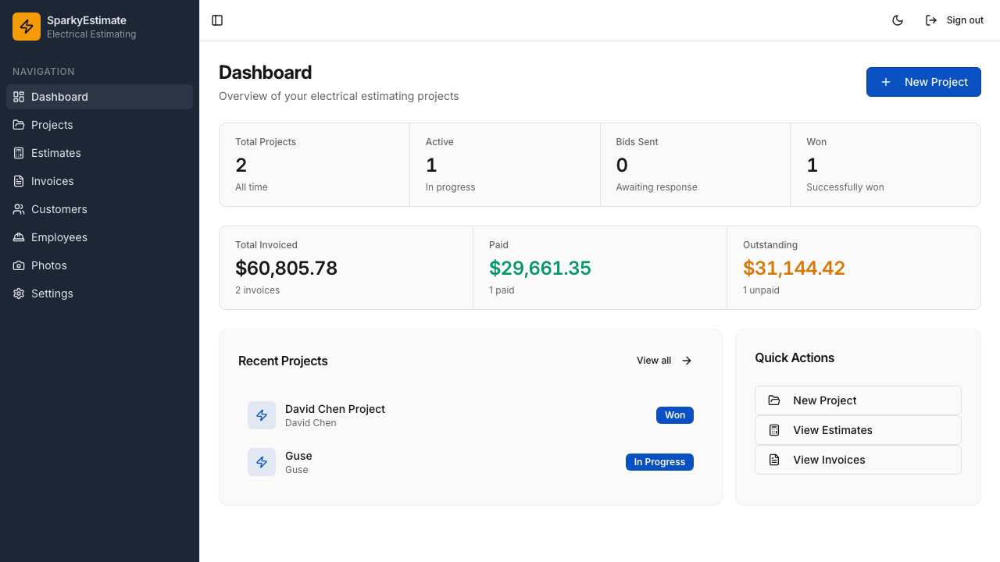
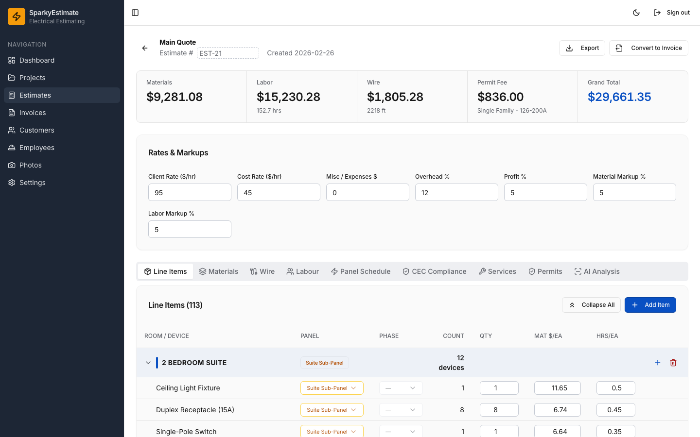
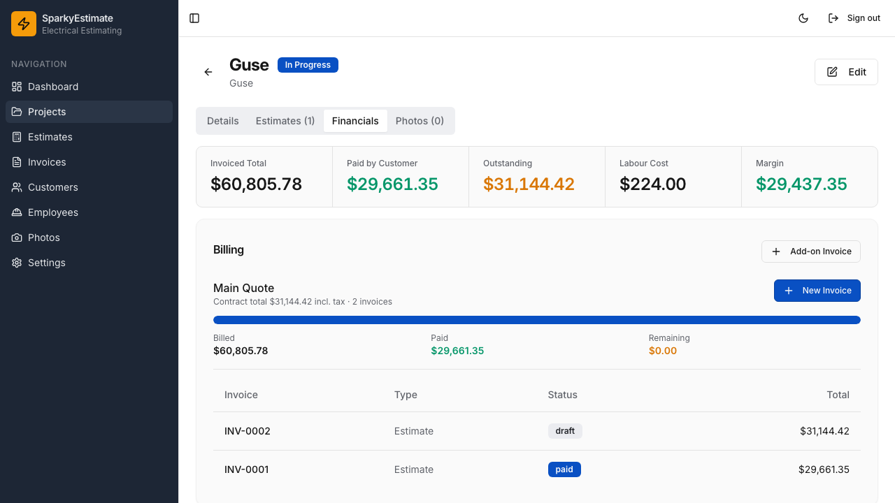
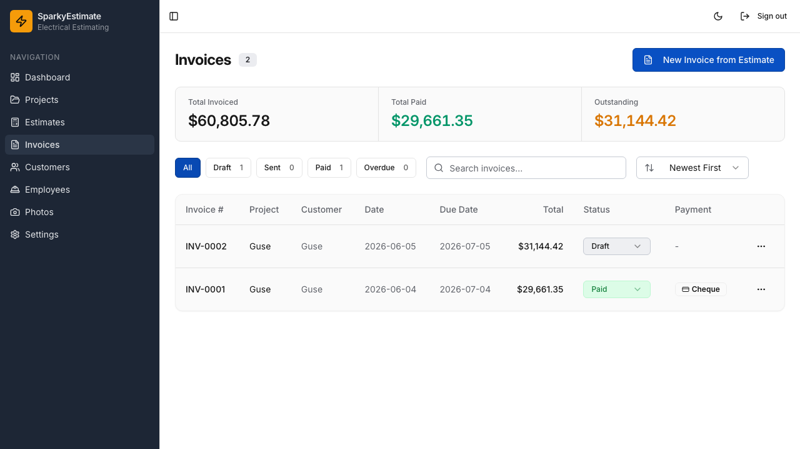

# SparkyEstimate

AI-assisted electrical estimating for Canadian residential contractors. Upload a floor plan, get a code-compliant device takeoff, turn it into a priced estimate, then bill it through to paid invoices and receipts.



## What it does

- **AI floor-plan analysis.** Drop in a PDF or image of a floor plan and Google Gemini perceives the rooms and electrical symbols. The model only does perception; the actual device counts and code requirements come from a deterministic rules engine (see [Architecture](#architecture)).
- **CEC 2021 compliance, deterministic.** Device quantities, wire sizing, circuit assignments, and panel demand are computed from hardcoded Canadian Electrical Code rules calibrated against real BC projects, with clause citations. No code book is ever fed to the LLM.
- **Estimate workflow.** Line items by room and phase, editable rates and markups, services, a panel schedule, wire takeoff, and a labour tab with a job-type multiplier. Every total flows from one shared calculation.
- **Billing.** Convert an estimate to an invoice in full, by phase (service / rough-in / finish), or as a custom progress payment. Add-on invoices bill extra work without touching the contract baseline. Each invoice tracks billed vs. paid vs. remaining.
- **Field portal.** Employees sign in with a PIN on a mobile portal to log hours and upload phase photos, isolated from the office app by a deny-by-default permission boundary.
- **Exports.** Branded PDF estimates, invoices, and receipts, plus material and labour Excel sheets.

## Screenshots

| Estimate | Project billing |
|---|---|
|  |  |

| Invoices |
|---|
|  |

## Tech stack

| Layer | Choice |
|---|---|
| Frontend | React 18, Vite, TypeScript, Tailwind CSS, shadcn/ui (Radix), TanStack Query, wouter |
| Backend | Express 5 (TypeScript, ESM), run via `tsx` |
| Database | PostgreSQL 16 with Drizzle ORM, Zod schemas shared client/server |
| AI | Google Gemini (`@google/genai`) for floor-plan perception |
| Docs/exports | jsPDF + jspdf-autotable, xlsx |
| Auth/security | express-session, bcrypt, AES-256-GCM at rest, helmet, express-rate-limit |

## Architecture

A few decisions worth calling out:

- **Deterministic code engine, not RAG.** `server/cec-devices.ts` and `server/cec-rules.ts` hold the Canadian Electrical Code logic. The LLM is confined to "what rooms and symbols are on this drawing." Everything that has to be correct (quantities, clause citations, demand calc) is plain code. Uploaded code documents are reference storage, never a prompt input.
- **One source of truth for money.** `shared/billing.ts` is the single estimate-total calculation. The on-screen estimate, the PDF, the invoice conversion, and the project billing hub all call it, so the number a customer sees can never drift from the number they are billed.
- **Privilege separation.** The office app and the field PIN portal share one server. A deny-by-default guard restricts PIN sessions to the handful of portal endpoints they actually need; everything else requires an office account.

See [docs/PROJECT_MAP.md](docs/PROJECT_MAP.md) for a fuller map and [docs/architecture.excalidraw](docs/architecture.excalidraw) for the workflow diagram.

## Project structure

```
sparkyestimate/
├── client/          React frontend (pages, components, shadcn/ui)
├── server/          Express API, storage layer, CEC engine, auth
├── shared/          Drizzle schema, Zod types, billing.ts (shared math)
├── script/          Build script
├── docs/            Project map, architecture diagram, screenshots
├── drizzle.config.ts
├── tailwind.config.ts
├── vite.config.ts
└── package.json
```

## Getting started

Prerequisites: Node 20+, PostgreSQL 16, a Google Gemini API key.

```bash
# 1. Install
npm install

# 2. Configure (copy the template and fill in values)
cp .env.example .env

# 3. Create the schema
npm run db:push

# 4. Run (Express + Vite on http://localhost:3000)
npm run dev
```

On first run an admin account is seeded from `ADMIN_USERNAME` / `ADMIN_PASSWORD`; if no password is set, a strong one is generated and printed once.

Key environment variables (full list in [.env.example](.env.example)):

| Variable | Purpose |
|---|---|
| `DATABASE_URL` | PostgreSQL connection string |
| `GEMINI_API_KEY` | Google Gemini key for floor-plan analysis |
| `SESSION_SECRET` | Session signing (required in production) |
| `CREDENTIAL_ENCRYPTION_KEY` | Optional, separate key for credentials at rest |

## Scripts

| Command | Description |
|---|---|
| `npm run dev` | Start Express + Vite in development |
| `npm run build` | Production build |
| `npm run start` | Run the production build |
| `npm run db:push` | Push the Drizzle schema to PostgreSQL |
| `npm run check` | TypeScript type check |

## Notes

This is a portfolio / showcase build. Canadian context throughout: CEC 2021, GST/PST, provinces, NMD-90 wire. The deterministic CEC quantities are calibrated from real residential projects.
